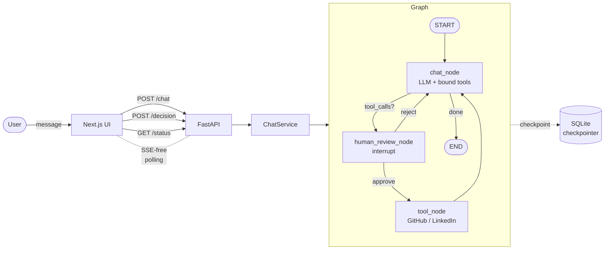

# HITL Chatbot

A memory-enabled chatbot built with **LangChain + LangGraph + FastAPI + Next.js**, demonstrating a clean **Human-in-the-Loop (HITL)** pattern: every tool call (GitHub repo lookup, LinkedIn profile lookup) pauses the agent for explicit user approval before execution.

---

## 🎯 What it does

- **Normal conversation** with Llama 3.3 70B via Groq, with persistent per-thread memory.
- When the LLM decides a tool call is needed, the graph **interrupts** and surfaces an approval card to the user.
- **Approve** → tool executes asynchronously, response is summarised back into the chat.
- **Reject** → graph resumes without running the tool, LLM acknowledges and continues.
- All conversation state is persisted to **SQLite** via LangGraph's `AsyncSqliteSaver`. Restart the server, reload the page, the conversation resumes.

---

## 🏛 Architecture



### Why this design

The single most important design decision is that **the LangGraph state is the single source of truth**. We do not maintain a parallel "is this thread waiting for approval" tracker in the database. The status of any thread is derived from `graph.aget_state(config)`:

| Graph state                       | Reported status      |
| --------------------------------- | -------------------- |
| no state for thread               | `empty`              |
| `state.next` empty                | `completed`          |
| `state.tasks[*].interrupts` set   | `pending_approval`   |
| `state.next` non-empty, no interrupt | `processing`      |

This eliminates a whole class of synchronisation bugs (DB says "approved" but graph hasn't resumed yet, etc.).

The same `AsyncSqliteSaver` provides **two** features at once: persistent conversation memory **and** the resume-after-interrupt mechanism for HITL. They're literally the same thing — every node transition is checkpointed, so resumption from any pause is automatic.

### Request flow

| # | What happens | Endpoint | Graph state after |
|---|--------------|----------|-------------------|
| 1 | User sends a message | `POST /chat` (sync) | `completed` or `pending_approval` |
| 2 | If pending, frontend renders approval card; user clicks approve/reject | `POST /chat/{id}/decision` (returns 202 immediately) | `processing` |
| 3 | Frontend polls every 800ms until graph is no longer running | `GET /chat/{id}/status` | `completed` (or `pending_approval` again, if multiple tools queued) |

---

## 📦 Project structure

```
hitl-chatbot/
├── backend/
│   ├── app/
│   │   ├── main.py                 # FastAPI app + lifespan
│   │   ├── core/config.py          # pydantic-settings
│   │   ├── api/
│   │   │   ├── deps.py
│   │   │   └── routes/
│   │   │       ├── chat.py         # POST /chat
│   │   │       ├── decision.py     # POST /chat/{id}/decision
│   │   │       └── status.py       # GET  /chat/{id}/status
│   │   ├── graph/
│   │   │   ├── builder.py          # StateGraph assembly
│   │   │   ├── nodes.py            # chat_node, human_review_node
│   │   │   ├── prompts.py
│   │   │   ├── state.py
│   │   │   └── tools/
│   │   │       ├── github_tool.py    # real (httpx + GitHub REST)
│   │   │       └── linkedin_tool.py  # mocked — see "design decisions"
│   │   ├── services/chat_service.py  # graph orchestration
│   │   └── schemas/chat.py           # request/response models
│   ├── tests/test_graph_flow.py      # end-to-end smoke test
│   ├── data/                         # SQLite checkpoint DB lives here
│   ├── requirements.txt
│   └── .env.example
└── frontend/
    ├── app/
    │   ├── layout.tsx
    │   ├── page.tsx                # main chat
    │   └── globals.css
    ├── components/
    │   ├── ChatWindow.tsx
    │   ├── MessageBubble.tsx
    │   ├── ApprovalCard.tsx        # the HITL UI moment
    │   ├── ChatInput.tsx
    │   └── ui/                     # button, input, card (shadcn-style)
    ├── hooks/useChat.ts            # state machine + polling
    ├── lib/
    │   ├── api.ts
    │   ├── types.ts
    │   └── utils.ts
    ├── package.json
    └── tailwind.config.ts
```

---

## 🚀 Getting started

### Prerequisites

- Python 3.10+
- Node.js 18+
- A free [Groq API key](https://console.groq.com/keys)
- (Optional) A GitHub personal access token for higher API rate limits

### 1. Backend

```bash
cd backend
python -m venv .venv
source .venv/bin/activate            # Windows: .venv\Scripts\activate
pip install -r requirements.txt

cp .env.example .env
# Edit .env and set GROQ_API_KEY=...

# (Optional) Run the standalone graph smoke test first:
python -m tests.test_graph_flow

# Start the API
uvicorn app.main:app --reload --port 8000
```

The OpenAPI docs are available at `http://localhost:8000/docs`.

### 2. Frontend

```bash
cd frontend
cp .env.local.example .env.local     # default points at localhost:8000
npm install
npm run dev
```

Open `http://localhost:3000`.

---

## 🧪 Try it

1. **Plain chat** — "Hi, what can you do?" → no tool call, just a response.
2. **GitHub tool** — "Look up the fastapi/fastapi repo" → an approval card appears. Click **Approve** → the tool runs asynchronously, then the assistant summarises the repo (stars, language, recent commits).
3. **LinkedIn tool, rejected** — "Find https://linkedin.com/in/satya-nadella" → approval card. Click **Reject** → the assistant acknowledges and continues without the lookup.
4. **Memory** — Ask "What was the first thing I asked you?" → the assistant references the earlier message. Persists across server restarts (SQLite).

---

## 🛠 Design decisions & tradeoffs

These are choices I made deliberately. Each could be expanded for a production system.

### 1. `interrupt()` inside a dedicated node, not `interrupt_before`
The HITL gate lives in its own `human_review_node` rather than via LangGraph's `interrupt_before` config. This makes the approval payload explicit (we control exactly what the frontend receives) and centralises both the approve and reject branching logic in one Python function. Easier to reason about, test, and extend (e.g. to add a "modify args before approval" branch later).

### 2. SQLite checkpointer for both memory and HITL
A single `AsyncSqliteSaver` provides persistent conversation memory AND the resume-after-interrupt mechanism. Swap-in `AsyncPostgresSaver` for production — it's a one-line change in `app/main.py`'s lifespan.

### 3. Polling instead of SSE for async tool execution
The `/decision` endpoint returns 202 immediately and runs the graph resume in `BackgroundTasks`. The frontend polls `/status` every 800ms until the thread is no longer `processing`. SSE would be more elegant but adds reconnection logic and edge cases for marginal UX gain. **Trade-off accepted** for the time budget; documented as a known improvement path.

### 4. LinkedIn tool is **mocked**, GitHub tool is **real**
- **GitHub**: real implementation against the public REST API. Works without auth (60 req/hr); works better with `GITHUB_TOKEN` (5000 req/hr).
- **LinkedIn**: deterministic mock with realistic latency (`asyncio.sleep(2.5)`). Real LinkedIn scraping requires either a paid API (Proxycurl, ~$0.01/req) or an unofficial library that LinkedIn actively blocks. The mock returns hash-deterministic but varied output so demos look real. **The architecture is tool-agnostic** — swapping the implementation is one file. This is a deliberate engineering call, not an oversight.

### 5. Single tool call per turn
The LLM is prompted to issue one tool call at a time. If it returns multiple, only the first is currently surfaced for approval. Handling N tool calls means iterating the human_review_node with separate interrupts per call — straightforward extension; deferred for scope.

### 6. Optimistic message rendering
When the user sends, we append their message locally before the API responds, for snappier perceived latency. The server response then replaces the message list with the canonical version from graph state. This keeps the UI honest while feeling fast.

### 7. State derivation, not state tracking
Already mentioned but worth repeating — *all* thread status is derived from `graph.aget_state()`, never stored separately. This is the single most defensive choice in the design.

---

## 🔬 Improvements:

- **SSE on `/status`** instead of polling, for sub-100ms approval-to-response feedback.
- **Multi-tool-call support** — iterate `human_review_node` over each pending tool call.
- **Retry on tool failure** with exponential backoff (currently fails the whole resume).
- **Input validation** on tool args before approval (e.g. reject obviously malformed GitHub URLs in the UI).
- **Auth** on the API (currently open; assumes trusted local network).
- **Postgres + dockerised deploy** — container with `docker-compose` for backend + Postgres + frontend.
- **Streaming token output** from `chat_node` for the typing-indicator feel.

---

## 📜 License

MIT. Feel free to fork or adapt.
